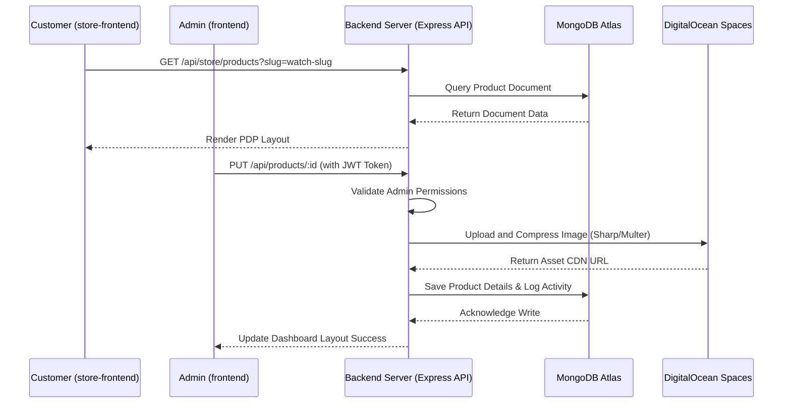

# IMS Project Briefing (IMS_17_FEB)

This document provides a comprehensive mapping of the directories, code architecture, environment configurations, and interconnectivity for the `IMS_17_FEB` workspace.

---

## 1. Directory Structure

The repository is organized into three main modules:
*   **`backend`**: Node.js & Express API server serving as the single source of truth for the Database (MongoDB), Storage (DigitalOcean Spaces), and payment gateway (Razorpay).
*   **`frontend`**: The Admin Panel built with React 18 + Vite + React Query, used for inventory management, audit logging, and orders administration.
*   **`store-frontend`**: The customer-facing eCommerce catalog portal built with React 19 + Vite + Tailwind CSS.

---

## 2. Module Specifications

### A. Backend (`/backend`)
*   **Entry Point**: [server.js](file:///c:/Users/upawa/Safe/AllInOne/IMS_17_FEB/backend/server.js)
*   **Technology Stack**: Express, Mongoose (MongoDB ODM), JWT (jsonwebtoken), Razorpay SDK, Nodemailer, Sharp (Image compression), Multer, and PDFKit.
*   **Key Database Schemas (`/backend/models`)**:
    *   `Product`: High-fidelity details including warranty, movement, dial dimensions, case size, and inventory counts.
    *   `Order`: Tracking of customer purchases, invoice logs, and status checks.
    *   `User`: Admin and staff authentication details.
    *   `ActivityLog`: System-wide audit logs tracking who made changes to inventory and orders.
    *   `StoreQuery`: Customer inquiry handling for luxury timepiece catalog elements.
*   **Routing & Connectivity**:
    *   `/api/auth` -> JWT authentication, login, and registration.
    *   `/api/products` & `/api/store/products` -> Catalog views and admin product management.
    *   `/api/orders` & `/api/store` -> Customer order processing, checkout validation, and Razorpay signature checks.
    *   `/api/store-admin` -> Administrative operations.
    *   `/api/blogs` -> Public catalog blogs.

### B. Admin Frontend (`/frontend`)
*   **Entry Point**: `src/main.jsx`
*   **Technology Stack**: React 18, Vite, Tailwind CSS, TanStack React Query, Axios.
*   **Responsibility**:
    *   Monitors real-time transactions, processes logs, reviews user analytics, and handles stock additions/deductions.
    *   Talks directly to `backend` endpoints using configurations inside [frontend/.env](file:///c:/Users/upawa/Safe/AllInOne/IMS_17_FEB/frontend/.env).

### C. Customer Frontend (`/store-frontend`)
*   **Entry Point**: `src/main.jsx`
*   **Technology Stack**: React 19, Vite, Tailwind CSS, Framer Motion, Lucide Icons.
*   **Responsibility**:
    *   Displays public catalogs, category collections, watch models (luxury/fashion filters), and handles inquiry/WhatsApp routing for premium items.
    *   Talks to the backend database endpoints mapped under [store-frontend/.env](file:///c:/Users/upawa/Safe/AllInOne/IMS_17_FEB/store-frontend/.env).

---

## 3. Data Flow & Connectivity Map

---

## 4. Key Configurations & Environment Settings

### Backend (`backend/.env`)
*   `NODE_ENV`: Runs in `production` mode to serve compressed API bundles.
*   `MONGODB_URI`: Points to MongoDB Atlas cluster `Cluster0` (database: `IMS`).
*   `JWT_SECRET`: Signature verification token for backend session validity.
*   `RAZORPAY_KEY_ID` / `RAZORPAY_KEY_SECRET`: Production credentials for processing transactions.
*   `DO_SPACES_KEY` / `DO_SPACES_SECRET`: Asset storage configuration folder `ims` inside `samaywatch-assets` bucket.
*   `EMAIL_USER` / `EMAIL_PASS`: SMTP mail configuration via Hostinger for customer invoices.

### Frontends (`.env` settings)
*   **Admin Panel**: `VITE_API_URL` -> Local backend `http://localhost:5000/api`.
*   **Storefront**: `VITE_API_URL` -> Deployed DigitalOcean cloud backend `https://ims5june-armfy.ondigitalocean.app`.
